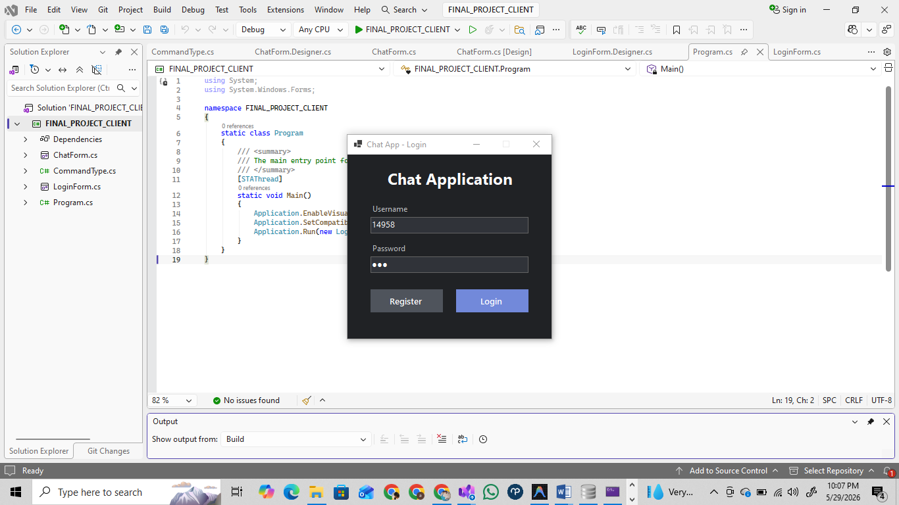
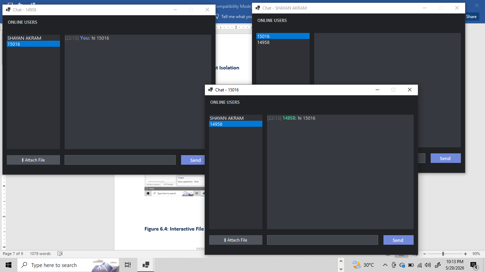

# C# TCP Chat Application

This is a comprehensive Client-Server chat application built using C# and .NET Windows Forms. It utilizes TCP sockets for real-time communication and an SQLite database for persistent storage of users and messages.

## Features

* **User Authentication**: Secure user registration and login system with password hashing (SHA256).
* **Real-time Messaging**: Instant text messaging between connected clients over TCP.
* **Offline Messaging**: Messages sent to offline users are stored in the database and delivered as soon as they log in.
* **File Transfer**: Support for sending and receiving files directly through the chat interface.
* **Active User List**: Real-time updates showing currently online users.
* **Persistent Storage**: SQLite database integration for storing user credentials and chat history.

## Project Structure

The solution consists of two main projects:
1. **FINAL_PROJECT_SERVER**: A console application that handles incoming TCP connections, manages the SQLite database (`chat.db`), routing messages and files between clients, and keeping track of online users.
2. **FINAL_PROJECT_CLIENT**: A Windows Forms application providing the graphical user interface for users to register, log in, chat, and transfer files.

## Prerequisites

* .NET Framework / .NET Core (compatible with Windows Forms)
* SQLite library (`System.Data.SQLite` via NuGet)

## Setup and Execution

1. Build both the Server and Client projects in Visual Studio.
2. Run the `FINAL_PROJECT_SERVER` executable first. It will start listening on port `9000` and automatically create the necessary `chat.db` database.
3. Run one or multiple instances of the `FINAL_PROJECT_CLIENT` executable to connect to the server.
4. Register a new account or log in with an existing one to start chatting!

## Screenshots

Here are some previews from the project documentation:

### Login & Registration

### Chat Interface

### File Transfer & Offline Messaging

*(Additional screenshots can be found in the `screenshots` folder extracted from the documentation).*

## Documentation

For full details, please refer to the provided documentation:
[Project_Documentation_14958.docx](Project_Documentation_14958.docx)
